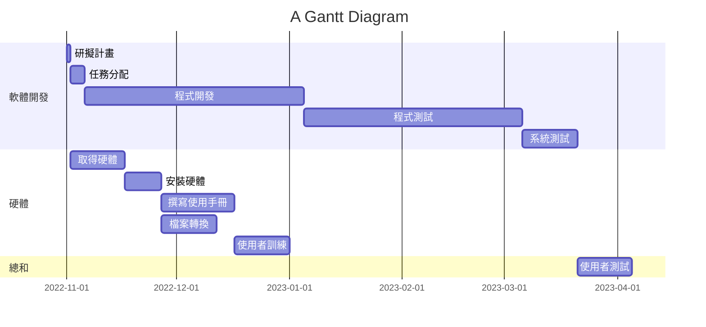

# 甘特圖:

```mermaid
gantt
    title A Gantt Diagram
    dateFormat  YYYY-MM-DD
    section 軟體開發
    研擬計畫 : a1, 2022-11-01, 1d
    任務分配 : a2, after a1, 4d
    程式開發 : a3, after a2, 60d
    程式測試 : a4, after a3, 60d
    系統測試 : a5, after a4, 15d
    section 硬體
    取得硬體 : b1, after a1, 15d
    安裝硬體 : b2, after b1, 10d
    撰寫使用手冊 : b3, after b2, 20d
    檔案轉換 : b4, after b2, 15d
    使用者訓練 : b5, after b3, 15d
    section 總和
    使用者測試 : after a5, 15d
  

```

---

# Pert圖與關鍵路徑:

