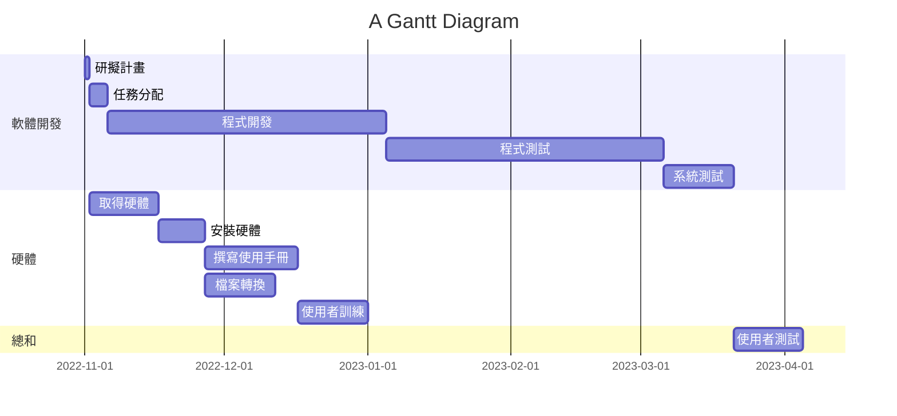
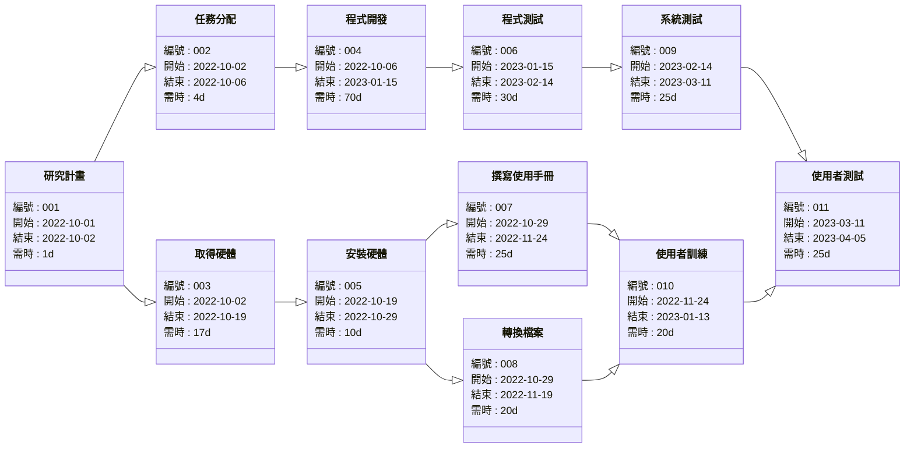

# 甘特圖:

```mermaid
gantt
    title A Gantt Diagram
    dateFormat  YYYY-MM-DD
    section 軟體開發
    研擬計畫 : a1, 2022-11-01, 1d
    任務分配 : a2, after a1, 4d
    程式開發 : a3, after a2, 60d
    程式測試 : a4, after a3, 60d
    系統測試 : a5, after a4, 15d
    section 硬體
    取得硬體 : b1, after a1, 15d
    安裝硬體 : b2, after b1, 10d
    撰寫使用手冊 : b3, after b2, 20d
    檔案轉換 : b4, after b2, 15d
    使用者訓練 : b5, after b3, 15d
    section 總和
    使用者測試 : after a5, 15d
  

```

---

# Pert圖與關鍵路徑:

```mermaid

classDiagram
  direction LR

  
  class 研究計畫 {
    編號 : 001
    開始 : 2022-10-01
    結束 : 2022-10-02
    需時 : 1d
  }
  class 任務分配{
    編號 : 002
    開始 : 2022-10-02
    結束 : 2022-10-06
    需時 : 4d
  }
  class 取得硬體{
    編號 : 003
    開始 : 2022-10-02
    結束 : 2022-10-19
    需時 : 17d
  }
  class 程式開發{
    編號 : 004
    開始 : 2022-10-06
    結束 : 2023-01-15
    需時 : 70d
  }
  class 安裝硬體{
    編號 : 005
    開始 : 2022-10-19
    結束 : 2022-10-29
    需時 : 10d
  }
  class 程式測試{
    編號 : 006
    開始 : 2023-01-15
    結束 : 2023-02-14
    需時 : 30d
  }
  class 撰寫使用手冊{
    編號 : 007
    開始 : 2022-10-29
    結束 : 2022-11-24
    需時 : 25d
  }
  class 轉換檔案{
    編號 : 008
    開始 : 2022-10-29
    結束 : 2022-11-19
    需時 : 20d
  }
  class 系統測試{
    編號 : 009
    開始 : 2023-02-14
    結束 : 2023-03-11
    需時 : 25d
  }
  class 使用者訓練{
    編號 : 010
    開始 : 2022-11-24
    結束 : 2023-01-13
    需時 : 20d
  }
  class 使用者測試{
    編號 : 011
    開始 : 2023-03-11
    結束 : 2023-04-05
    需時 : 25d
  }
  
  研究計畫 --|> 任務分配 
  研究計畫 --|> 取得硬體 
  任務分配 --|> 程式開發
  取得硬體 --|> 安裝硬體
  程式開發 --|> 程式測試
  安裝硬體 --|> 撰寫使用手冊
  安裝硬體 --|> 轉換檔案
  程式測試 --|> 系統測試
  撰寫使用手冊 --|> 使用者訓練
  轉換檔案 --|> 使用者訓練
  系統測試 --|> 使用者測試
  使用者訓練 --|> 使用者測試
```
